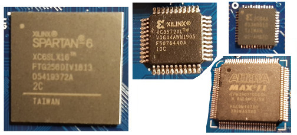

## working with FPGAs
I will use this "blog like" github repo to document what I have done with FPGAs.

## 11/20/2020
* Before trying to login into EBAZ4205 A9 Linux with USB2UART adapter [as described in xjtuecho's github repo](https://github.com/xjtuecho/EBAZ4205#reset-the-root-password-of-built-in-linux), I tested adapter to login into another Raspberry Pi. That did not work, bought new USB2UART adapter and that failed as well. Finally identified configuration issue responsible ... [more](https://www.raspberrypi.org/forums/viewtopic.php?f=66&t=291776)

## 11/19/2020
Received first Altera development board ordered on 10/31 — powering shows delivery demo:

## 11/18/2020
Today's Hackaday [Hacking The FPGA Control Board From A Bitcoin Miner](https://hackaday.com/2020/11/18/hacking-the-fpga-control-board-from-a-bitcoin-miner/) article references [xjtuecho's github repo](https://github.com/xjtuecho/EBAZ4205) with lots of details on how to deal with EBAZ4205 board I ordered initially 10/26 for 17$ on [aliexpress](https://www.aliexpress.com/item/1005001530141192.html) (how to power the board, shut down the BTC miner program in Linux running on board's dual core A9, setting static IP address for using ethernet finally, ...)
 

## 11/17/2020
* Received development board ordered 11/4 ... [more](2020/11/17/#11172020)  

* Received development board ordered 10/26 — powering shows delivery demo:  

## 11/5/2020
Was totally surprised about FPGA development board incl. 40pin display connector.  
Did order 15.90$ [Lichee Tang Nano FPGA development board with 4.3" display](https://www.aliexpress.com/item/4001275871300.html).

## 11/4/2020

* Registered at Xilinx for download&install of ISE Design Suite 14.7 ... [more](2020/11/4/#1142020)  

* Was surprised that 3.50$ FPGA development boards can be bought locally.  
Did buy [XILINX CoolRunner-II FPGA CPLD XC2C64A Core development board](https://www.ebay.de/itm/XILINX-CoolRunner-II-FPGA-CPLD-XC2C64A-Core-Module-Mini-Development-For-XBOX360/272864294476) for fast delivery.

## 11/3/2020
Received development board ordered 10/30 — powering shows delivery demo:  

## 10/31/2020
Ordered 8$ [Altera MAX II EPM240 CPLD Development Board](https://www.amazon.de/-/en/gp/product/B082LS4YBZ/ref=ppx_yo_dt_b_asin_title_o03_s00).

## 10/30/2020
Ordered 23$ [Xilinx XC9572XL CPLD development board](https://www.ebay.de/itm/Xilinx-XC9572XL-CPLD-Entwicklungsboard-für-Arduino-Raspberry-Pi/254189836214) locally for fast delivery.

## 10/27/2020
AMD Acquires Xilinx for $35 Billion ... [more](https://twitter.com/hackaday/status/1321171413462634497)  

## 10/26/2020
I decided to start learning on how to use FPGAs, read a lot, and ordered three cheap development boards ... [more](2020/10/26/#10262020)

## Field-programmable gate array (FPGA)  
[https://en.wikipedia.org/wiki/Field-programmable_gate_array](https://en.wikipedia.org/wiki/Field-programmable_gate_array)  

